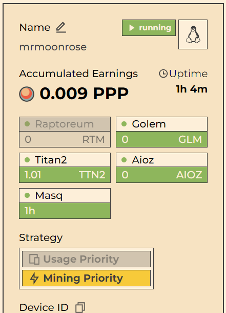

# PINGPONG
>[!NOTE]
>Evde kullandığım eski bilgisayara ubuntu server yüklemiştim aynı yere kurduğum Depin projelerinden birisi olan PingPong un kurulumunu yapıyorum. Düşük işlemci gücü ve masraflarından ötürü.

# 1 - Adım
>[Buradan](https://app.pingpong.build/points?invite_code=ZN8YXVqy) pingpong a kayıt oluyoruz.
Discord a katılma - Bridge - swap - stake görevleri var burada.

# 2 - Adım
>Sunucuyu kuracağız.

`sudo apt-get update`
`wget https://pingpong-build.s3.ap-southeast-1.amazonaws.com/linux/latest/PINGPONG`
`sudo apt-get install apt-transport-https ca-certificates curl software-properties-common`
`curl -fsSL https://download.docker.com/linux/ubuntu/gpg | sudo apt-key add -`
```
sudo add-apt-repository \
   "deb [arch=amd64] https://download.docker.com/linux/ubuntu \
   $(lsb_release -cs) \
   stable"
```
`sudo apt-get update`
`sudo apt-get install docker-ce`
`sudo systemctl start docker`
`sudo systemctl enable docker`
`sudo usermod -aG docker $USER`
`docker run hello-world`
Screen oluşturuyoruz - Yeni pencere açıyoruz bir nevi
`screen -S pin`

İlk başta kayıt olduğumuz sitedeki "MORE" kısmına tıklayıp. "Depin Harvester" kısmına giriyoruz. Burada yer alan "Add Device" kısmındaki "Device ID" yi kopyalıyoruz çünkü biraz sonraki kodun son kısmına ekleyip yazacağız kodu.
`chmod +x ./PINGPONG && ./PINGPONG --key burayi_silip_device_id_yaz`
> Resimdeki gibi olduktan sonra "CTRL + A + D" yaparak screen den çıkış yapıyoruz. Kurulum tamamdır. 
